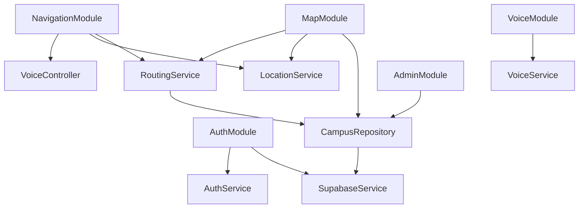
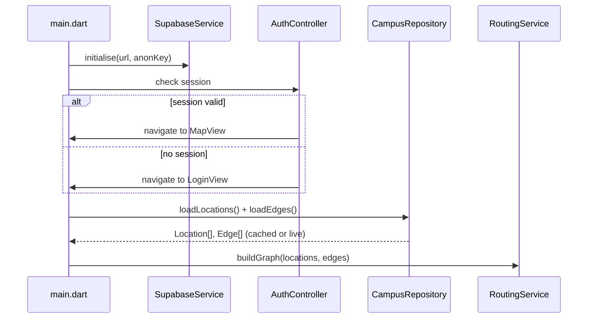
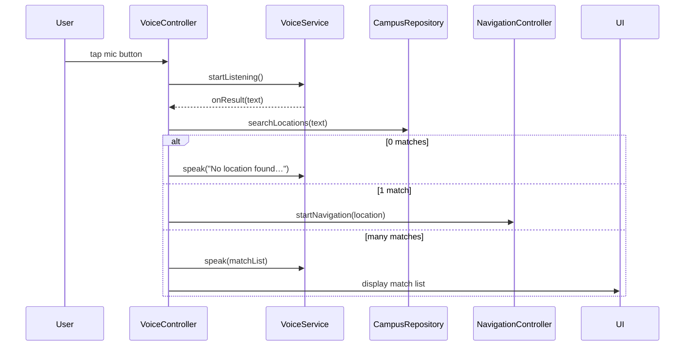
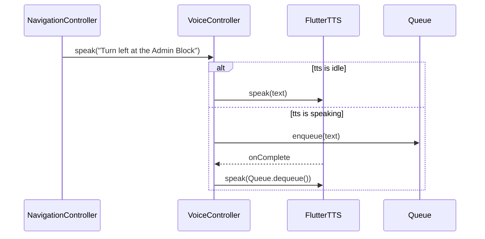

# Design Document: Campus Map Navigation

## Overview

The Campus Map is a Flutter mobile application (Android-first, iOS-compatible) that enables students, staff, and visitors of Bamidele Olumilua University of Education, Science and Technology (BOUESTI) to locate campus buildings, compute shortest-path walking routes using a custom Dijkstra algorithm, and follow spoken turn-by-turn directions via an integrated voice assistant.

The system is composed of four principal layers:

1. **Presentation Layer** — Flutter screens and widgets organised into feature modules (`auth`, `map`, `navigation`, `voice`, `admin`), each driven by a dedicated GetX controller.
2. **Domain / State Layer** — GetX controllers hold reactive state and coordinate user interactions with services.
3. **Data / Service Layer** — Services (`AuthService`, `SupabaseService`, `RoutingService`, `LocationService`, `VoiceService`) encapsulate external SDK calls and business logic. The `CampusRepository` mediates between controllers and services.
4. **Backend Layer** — Supabase (PostgreSQL + Auth + Row Level Security) stores campus locations, graph edges, and user profiles; the `google_maps_flutter` package renders the map tile.

### Key Design Decisions

- **GetX** is used for state management, dependency injection (bindings), and navigation. Each feature module has its own `Binding` class that lazily initialises its controller and required services, keeping startup cost low.
- **Dijkstra's algorithm** runs entirely on-device using an in-memory adjacency list built from the `locations` and `edges` tables. This keeps route computation fast and available offline once the graph is cached.
- **Supabase Realtime** subscriptions drive live updates to the map markers and routing graph so that Admin edits propagate to all connected clients without an app restart.
- **Offline resilience** is achieved by persisting the last-fetched location and edge data to local storage (using `shared_preferences` for serialised JSON) and serving cached data when the network is unavailable.

---

## Architecture

```
┌──────────────────────────────────────────────────────┐
│                   Flutter UI Layer                   │
│  AuthView  MapView  NavigationView  AdminDashboard   │
└──────────────┬───────────────────────────────────────┘
               │  GetX reactive bindings
┌──────────────▼───────────────────────────────────────┐
│               GetX Controllers (State)               │
│  AuthController  MapController  NavigationController │
│  VoiceController  AdminController                    │
└──────────────┬───────────────────────────────────────┘
               │  method calls / streams
┌──────────────▼───────────────────────────────────────┐
│            CampusRepository (data façade)            │
│  • Locations CRUD          • Edges CRUD              │
│  • Offline cache layer     • Realtime subscription   │
└────┬──────────────┬─────────────────┬────────────────┘
     │              │                 │
┌────▼────┐  ┌──────▼──────┐  ┌──────▼──────────┐
│  Auth   │  │  Supabase   │  │  RoutingService  │
│ Service │  │  Service    │  │  (Dijkstra)      │
└────┬────┘  └──────┬──────┘  └──────┬───────────┘
     │              │                │
┌────▼──────────────▼────────────────▼───────────┐
│  LocationService   VoiceService (STT + TTS)    │
│  (geolocator)      (speech_to_text + flutter_  │
│                     tts)                       │
└──────────────────────────────────────────────┘
               │
┌──────────────▼──────────────────────────────────┐
│               Supabase Backend                  │
│   PostgreSQL (locations, edges, profiles)       │
│   Supabase Auth  ·  Supabase Realtime           │
└─────────────────────────────────────────────────┘
```

### Module Dependency Graph



### Startup Sequence



---

## Components and Interfaces

### GetX Bindings

Each feature module registers its controller and services through a `Binding`. Controllers are created as lazy singletons so they are only instantiated when the associated route is first navigated to.

```dart
// Example: MapBinding
class MapBinding extends Bindings {
  @override
  void dependencies() {
    Get.lazyPut<SupabaseService>(() => SupabaseService());
    Get.lazyPut<CampusRepository>(() => CampusRepository(Get.find()));
    Get.lazyPut<LocationService>(() => LocationService());
    Get.lazyPut<RoutingService>(() => RoutingService(Get.find()));
    Get.lazyPut<MapController>(
      () => MapController(
        repository: Get.find(),
        locationService: Get.find(),
        routingService: Get.find(),
      ),
    );
  }
}
```

### AuthController

Responsibilities: manage registration / login / logout flows, session restoration, and routing guards.

Key reactive state:
- `Rx<User?> currentUser` — the active Supabase user, `null` when unauthenticated.
- `RxBool isLoading` — drives loading indicators.
- `RxString errorMessage` — drives inline form error banners.

Key methods:
- `Future<void> register(String username, String email, String password)`
- `Future<void> login(String email, String password)`
- `Future<void> logout()`
- `Future<void> restoreSession()` — called on app start.

### MapController

Responsibilities: fetch and display location markers, manage map camera, present location info panels, and relay location changes from the `LocationService`.

Key reactive state:
- `RxList<LocationModel> locations` — the full set of campus POIs.
- `Rx<LatLng?> userPosition` — live GPS position for the position indicator.
- `RxBool hasFetchError` — drives the error banner.
- `RxBool isOfflineMode` — drives the "data may be outdated" banner.

Key methods:
- `Future<void> fetchLocations()`
- `void onMarkerTapped(String locationId)`
- `void subscribeToRealtimeUpdates()`

### NavigationController

Responsibilities: orchestrate route computation, manage active-navigation state, track step progression, detect deviation, and trigger rerouting.

Key reactive state:
- `Rx<RouteModel?> activeRoute` — the current computed route.
- `RxInt currentStepIndex` — index into the route's turn instruction list.
- `RxDouble remainingDistance` — metres remaining to destination.
- `RxBool isNavigating`
- `RxBool isRerouting`

Key methods:
- `Future<void> startNavigation(LocationModel destination)`
- `void onPositionUpdate(LatLng position)`
- `Future<void> triggerReroute(LatLng currentPosition)`
- `void cancelNavigation()`
- `bool _hasDeviated(LatLng position, List<LatLng> polyline)` — returns `true` when position is >30 m from nearest polyline point.

### VoiceController

Responsibilities: expose STT and TTS to other controllers; manage the TTS utterance queue; handle mute state.

Key reactive state:
- `RxBool isMuted`
- `RxBool isListening`
- `RxList<String> ttsQueue`

Key methods:
- `Future<void> startListening()`
- `void stopListening()`
- `Future<void> speak(String text)` — enqueues; plays after any current utterance.
- `void mute()` / `void unmute()`

### AdminController

Responsibilities: CRUD for `locations` and `edges` tables, input validation, atomic delete with edge cleanup.

Key methods:
- `Future<void> createLocation(LocationModel location)`
- `Future<void> updateLocation(LocationModel location)`
- `Future<void> deleteLocation(String locationId)` — atomically deletes edges first.
- `Future<void> createEdge(EdgeModel edge)`
- `Future<void> deleteEdge(String edgeId)`

### CampusRepository

The single data façade. All controllers interact with Supabase through this class only.

```dart
abstract class CampusRepository {
  Future<List<LocationModel>> fetchLocations();
  Future<List<EdgeModel>> fetchEdges();
  Future<void> insertLocation(LocationModel loc);
  Future<void> updateLocation(LocationModel loc);
  Future<void> deleteLocation(String id);
  Future<void> insertEdge(EdgeModel edge);
  Future<void> deleteEdge(String id);
  Future<List<LocationModel>> searchLocations(String query);
  Stream<List<LocationModel>> locationsStream();
  Stream<List<EdgeModel>> edgesStream();
}
```

The concrete `SupabaseCampusRepository` implementation caches results to `shared_preferences` on every successful fetch and falls back to the cache on network failure.

### RoutingService

Builds and queries the campus graph.

```dart
class RoutingService {
  /// Constructs the adjacency-list graph from fetched data.
  void buildGraph(List<LocationModel> locations, List<EdgeModel> edges);

  /// Runs Dijkstra from [origin] to [destination].
  /// Returns null if no path exists.
  RouteModel? computeRoute(GraphNode origin, GraphNode destination);

  /// Finds the GraphNode whose (lat, lng) is closest to [position].
  GraphNode nearestNode(LatLng position);
}
```

---

## Data Models

### LocationModel

```dart
class LocationModel {
  final String id;
  final String name;
  final String department;
  final double lat;
  final double lng;
  final String hours;
  final DateTime createdAt;
}
```

Maps 1-to-1 with the `locations` Supabase table.

### GraphNode

```dart
class GraphNode {
  final String id;         // same as LocationModel.id
  final String name;
  final double lat;
  final double lng;
}
```

A lightweight vertex representation used exclusively by `RoutingService`. Constructed from `LocationModel` instances. Path-junction nodes that have no corresponding POI (if needed in future) can be inserted without a `LocationModel` entry.

### EdgeModel

```dart
class EdgeModel {
  final String id;
  final String fromLocationId;
  final String toLocationId;
  final double distanceMeters;
}
```

Maps 1-to-1 with the `edges` Supabase table.

### UserProfile

```dart
class UserProfile {
  final String id;        // UUID, FK to auth.users
  final String username;
  final bool isAdmin;
}
```

### RouteModel

```dart
class RouteModel {
  final List<GraphNode> nodes;         // ordered waypoints
  final List<String> turnInstructions; // one per inter-node step
  final double totalDistanceMeters;
  final GraphNode destination;
}
```

`turnInstructions[i]` describes the move from `nodes[i]` to `nodes[i+1]`.

### AdjacencyList (internal to RoutingService)

```dart
typedef AdjacencyList = Map<String, List<_WeightedEdge>>;

class _WeightedEdge {
  final String targetNodeId;
  final double weight;   // distance_meters
}
```

---

## Supabase Schema and RLS Policies

### Table: `locations`

```sql
CREATE TABLE locations (
  id           UUID PRIMARY KEY DEFAULT gen_random_uuid(),
  name         TEXT NOT NULL,
  department   TEXT NOT NULL DEFAULT '',
  lat          DOUBLE PRECISION NOT NULL,
  lng          DOUBLE PRECISION NOT NULL,
  hours        TEXT NOT NULL DEFAULT '',
  created_at   TIMESTAMPTZ NOT NULL DEFAULT now()
);
```

### Table: `edges`

```sql
CREATE TABLE edges (
  id                UUID PRIMARY KEY DEFAULT gen_random_uuid(),
  from_location_id  UUID NOT NULL REFERENCES locations(id) ON DELETE CASCADE,
  to_location_id    UUID NOT NULL REFERENCES locations(id) ON DELETE CASCADE,
  distance_meters   DOUBLE PRECISION NOT NULL CHECK (distance_meters > 0)
);
```

### Table: `profiles`

```sql
CREATE TABLE profiles (
  id        UUID PRIMARY KEY REFERENCES auth.users(id) ON DELETE CASCADE,
  username  TEXT UNIQUE NOT NULL,
  is_admin  BOOLEAN NOT NULL DEFAULT FALSE
);
```

A database trigger on `auth.users` INSERT creates the corresponding `profiles` row with `is_admin = false`.

### RLS Policies

**`locations` table**

```sql
-- All authenticated users can read
CREATE POLICY "locations_select" ON locations
  FOR SELECT TO authenticated USING (true);

-- Only admins can insert / update / delete
CREATE POLICY "locations_insert" ON locations
  FOR INSERT TO authenticated
  WITH CHECK (
    (SELECT is_admin FROM profiles WHERE id = auth.uid()) = true
  );

CREATE POLICY "locations_update" ON locations
  FOR UPDATE TO authenticated
  USING (
    (SELECT is_admin FROM profiles WHERE id = auth.uid()) = true
  );

CREATE POLICY "locations_delete" ON locations
  FOR DELETE TO authenticated
  USING (
    (SELECT is_admin FROM profiles WHERE id = auth.uid()) = true
  );
```

**`edges` table** — identical admin-only write policies; SELECT open to authenticated users.

**`profiles` table**

```sql
-- Users can read their own profile
CREATE POLICY "profiles_select_own" ON profiles
  FOR SELECT TO authenticated USING (id = auth.uid());

-- Users can update their own profile (username only; is_admin is immutable by users)
CREATE POLICY "profiles_update_own" ON profiles
  FOR UPDATE TO authenticated
  USING (id = auth.uid())
  WITH CHECK (id = auth.uid());

-- Admins can read all profiles
CREATE POLICY "profiles_select_admin" ON profiles
  FOR SELECT TO authenticated
  USING ((SELECT is_admin FROM profiles WHERE id = auth.uid()) = true);
```

RLS is enabled on all three tables (`ALTER TABLE … ENABLE ROW LEVEL SECURITY`).

---

## Dijkstra's Algorithm Implementation Design

The `RoutingService` uses a min-heap priority queue over (distance, nodeId) pairs. The algorithm is a standard single-source shortest-path with early termination on reaching the destination.

```
function dijkstra(graph, originId, destinationId):
  dist ← map of nodeId → infinity
  prev ← map of nodeId → null
  dist[originId] ← 0
  pq ← MinHeap{(0, originId)}

  while pq is not empty:
    (d, u) ← pq.extractMin()
    if u == destinationId: break          // early exit
    if d > dist[u]: continue             // stale entry
    for each (v, w) in adjacencyList[u]:
      alt ← dist[u] + w
      if alt < dist[v]:
        dist[v] ← alt
        prev[v] ← u
        pq.insert((alt, v))

  if dist[destinationId] == infinity: return null

  // reconstruct path
  path ← []
  u ← destinationId
  while u != null:
    path.prepend(u)
    u ← prev[u]
  return RouteModel(nodes: path, totalDistanceMeters: dist[destinationId])
```

Dart does not ship a built-in min-heap. A simple implementation using a sorted `List` is sufficient for campus-scale graphs (expected < 200 nodes). For production, the `collection` package's `HeapPriorityQueue` can be used.

### Nearest-Node Resolution

Before running Dijkstra, the user's GPS `LatLng` is converted to a `GraphNode` by computing the Haversine distance to every node and selecting the minimum. This is O(n) and acceptable for campus-scale graphs.

### Graph Rebuild on Admin Changes

When `CampusRepository` emits a new event from `locationsStream()` or `edgesStream()`:
1. `RoutingService` sets a `_rebuildPending` flag.
2. Any in-flight `computeRoute` call completes before the rebuild begins.
3. `buildGraph` is called with the latest data.
4. Queued route requests are processed.

---

## GetX State Management Patterns

### Reactive State with `Rx`

All observable state is declared as `Rx<T>` and exposed via `.obs`. Views use `Obx(() => ...)` to rebuild only when the relevant observable changes.

```dart
// NavigationController excerpt
final activeRoute = Rx<RouteModel?>(null);
final currentStepIndex = 0.obs;
final remainingDistance = 0.0.obs;
```

### Workers

GetX workers handle side effects triggered by state changes:

```dart
// Fires TTS when step index changes
ever(currentStepIndex, (int index) {
  if (activeRoute.value != null) {
    voiceController.speak(activeRoute.value!.turnInstructions[index]);
  }
});

// Fires reroute check on every GPS update
ever(userPosition, (LatLng? pos) {
  if (pos != null && isNavigating.value) {
    _checkDeviation(pos);
  }
});
```

### Dependency Injection via Bindings

Services are registered once per binding and fetched with `Get.find<T>()`. Controllers access services through constructor injection to remain unit-testable without GetX.

### Route Guards

A `GetMiddleware` subclass (`AuthMiddleware`) calls `Get.offAllNamed(Routes.LOGIN)` if `AuthController.currentUser` is null when navigating to protected routes.

---

## Voice Assistant Integration

### STT Search Flow



`VoiceService.startListening()` wraps `speech_to_text`'s `listen()` with a timeout of 10 seconds. If no speech is detected, it calls `stopListening()` automatically and notifies `VoiceController` with an empty string.

### TTS Navigation Flow

The `VoiceController` maintains a `Queue<String>` of pending utterances. When `flutter_tts` fires `onComplete`, the next item is dequeued and spoken. Muting clears the queue and calls `flutterTts.stop()`.



---

## GPS Tracking and Deviation Detection

### Location Stream

`LocationService` exposes a `Stream<Position>` via `geolocator`'s `getPositionStream()`. The stream is configured with:
- `distanceFilter: 5` — emit only when the device moves ≥ 5 m (reduces battery drain).
- `desiredAccuracy: LocationAccuracy.high`.

`MapController` and `NavigationController` both subscribe to this stream via `StreamSubscription` stored in the controller and cancelled in `onClose()`.

### Deviation Detection Algorithm

For each GPS update during active navigation:

1. Iterate over every consecutive pair of polyline points `(A, B)`.
2. Compute the perpendicular distance from the user's position `P` to segment `AB` using the Haversine formula.
3. Track the minimum distance across all segments.
4. If `minDistance > 30 m` → trigger reroute.

This runs in O(n) where n is the number of polyline points (usually < 50 for campus routes).

### GPS Signal Loss

`LocationService` detects signal loss when the stream emits no update for > 15 seconds. It notifies `NavigationController` via a boolean stream `hasSignal`, which sets the "GPS lost" banner and pauses deviation checks.

---

## Admin CRUD Flows

### Create Location

```
AdminController.createLocation(loc)
  → validate(name ≠ empty, lat/lng valid)
  → CampusRepository.insertLocation(loc)
  → Supabase INSERT locations
  → Realtime event fires
  → MapController.fetchLocations() refreshes markers
```

### Atomic Location Delete

```
AdminController.deleteLocation(id)
  → CampusRepository.deleteLocation(id)
    → Supabase: BEGIN transaction
    → DELETE FROM edges WHERE from_location_id = id OR to_location_id = id
    → DELETE FROM locations WHERE id = id
    → COMMIT  (or ROLLBACK on failure)
  → on success: Realtime fires → MapController + RoutingService rebuild
  → on failure: display error, no partial delete
```

> Note: Because `edges.from_location_id` and `edges.to_location_id` have `ON DELETE CASCADE` constraints, a single `DELETE FROM locations WHERE id = id` already cascades to edges automatically at the database level. The `AdminController` additionally performs a client-side check to surface errors cleanly if the FK constraint itself fails.

### Edge Validation

Before inserting an edge, `AdminController` checks:
- `distanceMeters > 0` (also enforced by DB `CHECK` constraint).
- `fromLocationId != toLocationId`.
- Both location IDs exist in the current locations list.

---

## Error Handling

### Error Taxonomy

| Layer | Error Type | Handling |
|-------|-----------|---------|
| Network / Supabase | `PostgrestException`, timeout | Return cached data; show banner |
| Auth | Invalid credentials | Surface human-readable message; no crash |
| GPS | Permission denied | Browse-only mode; settings deep link |
| GPS | Signal lost | Pause navigation; show banner |
| Routing | No path found | Show "no navigable path" message |
| Routing | Malformed edge | Log + skip edge; continue |
| Maps SDK | Tile load failure | Show error widget; no crash |
| TTS / STT | Permission denied | Show permission dialog |

### Offline Cache Strategy

```
CampusRepository.fetchLocations():
  try:
    data ← supabaseService.getLocations()
    cacheService.save('locations', data.toJson())
    return data
  catch NetworkException:
    cached ← cacheService.load('locations')
    if cached != null:
      mapController.isOfflineMode = true
      return LocationModel.fromJsonList(cached)
    else:
      mapController.hasFetchError = true
      return []
```

Cache is stored as JSON strings in `shared_preferences`. Cache keys: `'campus_locations'`, `'campus_edges'`.

### Navigation Resilience

- Rerouting failures retain the previous route; navigation continues on the old path.
- GPS loss pauses deviation detection but keeps the route overlay and turn instructions visible.
- All asynchronous operations use `try/catch` wrappers; uncaught errors are reported via `GetX`'s `Get.snackbar` fallback.

---

## Correctness Properties

*A property is a characteristic or behavior that should hold true across all valid executions of a system — essentially, a formal statement about what the system should do. Properties serve as the bridge between human-readable specifications and machine-verifiable correctness guarantees.*

### Property 1: Route Weight Consistency

*For any* valid origin–destination pair where a path exists in the campus graph, the total distance of the route returned by `RoutingService.computeRoute` SHALL equal the sum of the `distanceMeters` values of each consecutive edge in the route's node sequence.

**Validates: Requirements 5.7**

---

### Property 2: Route Symmetry on Undirected Graphs

*For any* two distinct campus graph nodes A and B, where both `computeRoute(A, B)` and `computeRoute(B, A)` return non-null routes, the total distance of the route from A to B SHALL equal the total distance of the route from B to A when all edges are undirected (i.e., every edge is represented in both directions with equal weight).

**Validates: Requirements 5.8**

---

### Property 3: Dijkstra Optimality

*For any* valid origin–destination pair on a randomly generated graph, the total distance of the route returned by `RoutingService.computeRoute` SHALL be less than or equal to the total distance of every other valid path between the same endpoints (verified by comparing against a brute-force path enumeration on small graphs).

**Validates: Requirements 5.3**

---

### Property 4: Nearest-Node Correctness

*For any* GPS position P and campus graph with N nodes, the node returned by `RoutingService.nearestNode(P)` SHALL have a Haversine distance to P that is less than or equal to the Haversine distance from P to every other node in the graph.

**Validates: Requirements 5.2**

---

### Property 5: Location Search Case-Insensitivity and Partial Match

*For any* set of campus location names and any non-empty substring S derived from one of those names (in any capitalisation), `CampusRepository.searchLocations(S)` SHALL include that location in its result set and SHALL NOT include locations whose names do not contain S as a case-insensitive substring.

**Validates: Requirements 8.4**

---

### Property 6: TTS Queue Ordering

*For any* sequence of `speak(text)` calls made to `VoiceController` while a previous utterance is playing, the utterances SHALL be delivered to `flutter_tts` in the same FIFO order they were enqueued, with no utterance skipped or reordered.

**Validates: Requirements 9.2**

---

### Property 7: Admin Form Validation Rejects Invalid Inputs

*For any* location form submission where `name` is empty or composed entirely of whitespace characters (or where `lat` or `lng` is absent), AND for any edge form submission where `distanceMeters` is zero or negative, the `AdminController` SHALL reject the submission without writing to Supabase and the local locations or edges list SHALL remain unchanged after the rejection.

**Validates: Requirements 10.7, 11.4**

---

### Property 8: Graph Malformed-Edge Exclusion

*For any* set of location records and edge records where one or more edges reference non-existent location IDs, `RoutingService.buildGraph` SHALL complete without throwing an exception, the resulting graph SHALL contain only edges whose both endpoint IDs exist in the provided location records, and `computeRoute` SHALL still return correct results for all well-formed node pairs.

**Validates: Requirements 4.4**

---

### Property 9: RLS Write Rejection for Non-Admins

*For any* authenticated user whose `profiles.is_admin` is `false`, any direct Supabase INSERT, UPDATE, or DELETE operation on the `locations` or `edges` tables SHALL be rejected by RLS with a permission error and SHALL NOT modify table data.

**Validates: Requirements 10.6**

---

### Property 10: Graph Construction Fidelity

*For any* set of valid `LocationModel` records and `EdgeModel` records, after calling `RoutingService.buildGraph`, every location record SHALL have a corresponding `GraphNode` with identical `id`, `name`, `lat`, and `lng` fields, and every well-formed edge record SHALL produce an adjacency-list entry with a weight equal to that edge's `distanceMeters`.

**Validates: Requirements 4.2, 4.3**

---

### Property 11: Marker Placement Completeness

*For any* set of N location records fetched by `MapController`, the resulting set of map markers SHALL contain exactly N markers, each positioned at the `lat`/`lng` coordinates of its corresponding location record, with no duplicate or missing markers.

**Validates: Requirements 3.2**

---

### Property 12: Deviation Detection Threshold

*For any* user GPS position P and active route polyline, the result of `NavigationController._hasDeviated(P, polyline)` SHALL be `true` if and only if the minimum perpendicular Haversine distance from P to any segment of the polyline exceeds 30 metres.

**Validates: Requirements 7.2**

---

## Testing Strategy

### Dual Testing Approach

The feature uses two complementary test layers:

1. **Unit / example-based tests** — verify specific scenarios, edge cases, and integration points between components.
2. **Property-based tests** — verify universal correctness properties across randomly generated inputs, using the [`dart_test`](https://pub.dev/packages/test) framework together with [`fast_check`](https://pub.dev/packages/fast_check) (a Dart port of the fast-check PBT library).

> Each property-based test MUST run a minimum of **100 iterations** and MUST be tagged with a comment referencing its design property:
> `// Feature: campus-map-navigation, Property N: <property text>`

### Property-Based Tests (PBT)

| Property | Test Focus | Generator Inputs |
|----------|-----------|-----------------|
| P1: Route Weight Consistency | `RoutingService.computeRoute` | Random graphs with 5–50 nodes and valid edges |
| P2: Route Symmetry | `computeRoute(A,B)` vs `computeRoute(B,A)` | Random undirected graphs |
| P3: Dijkstra Optimality | Compare against brute-force path enumeration | Random graphs with 3–10 nodes |
| P4: Nearest-Node Correctness | `RoutingService.nearestNode` | Random LatLng positions and node sets |
| P5: Location Search | `CampusRepository.searchLocations` | Random location names, random substrings/cases |
| P6: TTS Queue Order | `VoiceController` utterance ordering | Random sequences of 1–20 speak() calls |
| P7: Admin Input Rejection | `AdminController` validation | Random whitespace strings, random ≤0 distances |
| P8: Malformed Edge Exclusion | `RoutingService.buildGraph` | Random edge sets with injected invalid IDs |
| P9: RLS Non-Admin Write Rejection | Supabase RLS policies | Random non-admin credentials, random write ops |
| P10: Graph Construction Fidelity | `RoutingService.buildGraph` field mapping | Random LocationModel + EdgeModel sets |
| P11: Marker Placement Completeness | `MapController` marker list | Random location sets of size 1–100 |
| P12: Deviation Detection Threshold | `NavigationController._hasDeviated` | Random positions, random polylines |

### Unit / Example-Based Tests

- `AuthController`: registration validation (email format, password length, duplicate username).
- `MapController`: marker placement from fixture location data; offline banner display.
- `NavigationController`: step advancement, arrival detection (within 15 m radius), deviation trigger (>30 m threshold).
- `AdminController`: atomic delete rolls back on edge deletion failure; self-loop edge rejection.
- `CampusRepository`: cache fallback when network throws; Realtime subscription propagation.

### Integration Tests

- Login → map loads with markers (requires Supabase test project or mock).
- Admin creates location → map reflects new marker via Realtime.
- Voice STT → route computed → TTS speaks first instruction.

### Test Configuration

```yaml
# pubspec.yaml dev_dependencies
dev_dependencies:
  flutter_test:
    sdk: flutter
  test: ^1.25.0
  fast_check: ^0.1.0   # property-based testing
  mocktail: ^1.0.0     # mocking services
```

```dart
// Example property test skeleton
// Feature: campus-map-navigation, Property 1: Route Weight Consistency
test('route total distance equals sum of edge weights', () {
  fc.assert(
    fc.property(arbitraryCampusGraph(), (graph) {
      final service = RoutingService()..buildGraph(graph.locations, graph.edges);
      final origin = graph.nodes.first;
      final destination = graph.nodes.last;
      final route = service.computeRoute(origin, destination);
      if (route == null) return; // no path — skip
      final edgeSum = _sumEdgesAlongRoute(route, graph.edges);
      expect(route.totalDistanceMeters, closeTo(edgeSum, 1e-9));
    }),
    numRuns: 100,
  );
});
```
